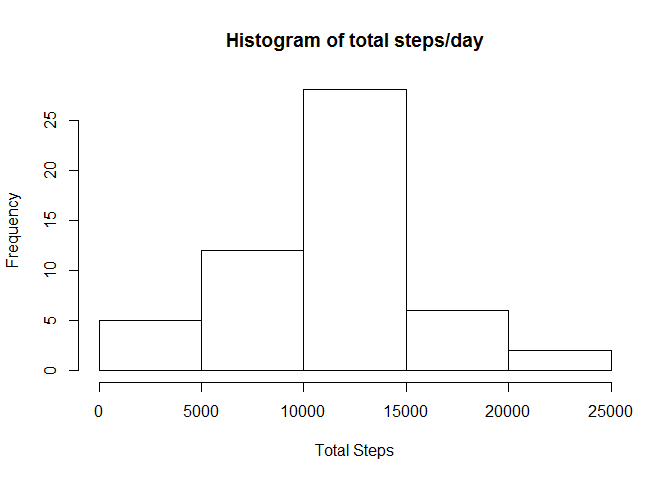
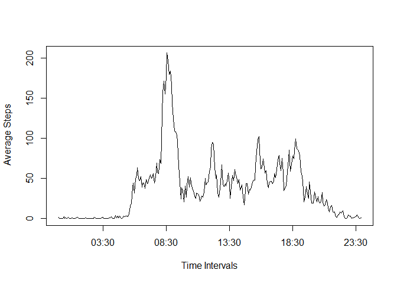
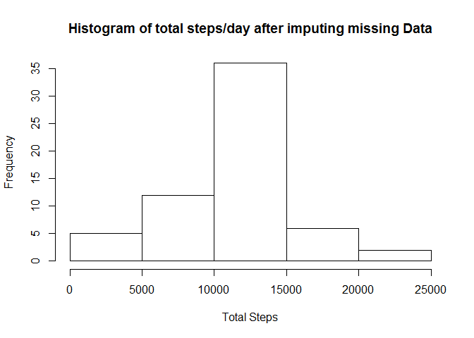
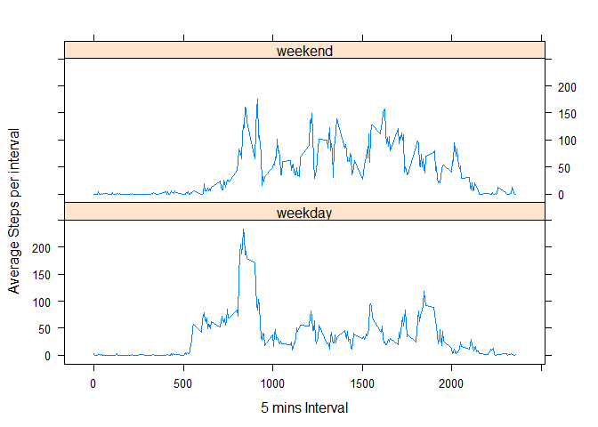

# Reproducible Research: Peer Assessment 1


## Loading and preprocessing the data


```r
activityData <- read.csv(file = "./activity.csv",
                         na.strings = "NA",
                         sep=",")
```
Removing NA from the Data

```r
activityExNAs <- activityData[!is.na(activityData$steps),]
```

## What is mean total number of steps taken per day?
Using dplyr package, Calculating the total number of steps taken per day

```r
library(dplyr)
summaryTotalStepdays <- summarize(group_by(activityExNAs, date),
                                  totalSteps=sum(steps))
```
Histogram of the total number of steps taken each day

```r
hist(summaryTotalStepdays$totalSteps,
     xlab = "Total Steps",
     main = "Histogram of total steps/day")
```

 
Calculating the mean and median of the total number of steps taken per day


```r
mean(summaryTotalStepdays$totalSteps)
```

```
## [1] 10766.19
```

```r
median(summaryTotalStepdays$totalSteps)
```

```
## [1] 10765
```

## What is the average daily activity pattern?

A time series plot of the 5-minute interval (x-axis) and the average number of steps taken, averaged across all days (y-axis)

```r
intervals=strptime(sprintf("%04d", as.numeric(activityExNAs$interval)), format="%H%M")

activityDataWithTimeInterval <- cbind(activityExNAs, intervals )

summaryAvgStepsperInt <- summarize(group_by (activityDataWithTimeInterval,interval, intervals), avgSteps=mean(steps) )

plot(x=summaryAvgStepsperInt$intervals, y = summaryAvgStepsperInt$avgSteps, type="l", xlab = "Time Intervals", ylab=" Average Steps")
```

 
Which 5-minute interval, on average across all the days in the dataset, contains the maximum number of steps?


```r
maxAvgInterval <- (summaryAvgStepsperInt[summaryAvgStepsperInt$avgSteps==max(summaryAvgStepsperInt$avgSteps),]$interval[1])
maxAvgInterval
```

[1] 835


## Imputing missing values
There are a number of days/intervals where there are missing values (coded as NA). The presence of missing days may introduce bias into some calculations or summaries of the data.
Calculate and report the total number of missing values in the dataset (i.e. the total number of rows with NAs)


```r
table(is.na(activityData$steps)) # NA are found in Steps column
```

```
## 
## FALSE  TRUE 
## 15264  2304
```

```r
table(is.na(activityData$interval)) # NA are not found in interval column
```

```
## 
## FALSE 
## 17568
```

```r
table(is.na(activityData$date))# NA are not found in date column
```

```
## 
## FALSE 
## 17568
```
Devising a strategy by filling in all of the missing values in the dataset considering the mean for that 5-minute interval for missing values. And creating a new dataset that is having same rows to the original dataset

```r
activityDataWithNas <- activityData

for( i in which(is.na(activityDataWithNas$steps))){
        activityDataWithNas$steps[i] = round(summaryAvgStepsperInt[summaryAvgStepsperInt$interval == activityDataWithNas$interval[i],]$avgSteps[1], digits = 0)
}
```
Plotting a histogram of the total number of steps taken each day using new data set


```r
summaryAfterReplacingNAs <- summarize(group_by(activityDataWithNas, date),
                                      totalSteps=sum(steps) )

hist(summaryAfterReplacingNAs$totalSteps,
     xlab = "Total Steps",
     main ="Histogram of total steps/day after imputing missing Data")
```

 


Calculating the mean and median of the total number of steps taken per day


```r
mean(summaryAfterReplacingNAs$totalSteps)
```

```
## [1] 10765.64
```

```r
median(summaryAfterReplacingNAs$totalSteps)
```

```
## [1] 10762
```

Mean and Median both changes attibuting to filling of missing Data.


## Are there differences in activity patterns between weekdays and weekends?

Introducing a new factor variable in the dataset with two levels - "weekday" and "weekend" indicating whether a given date is a weekday or weekend day.


```r
activityDatawithWeekdayCol <- mutate(activityExNAs,
                                     weekday = factor(weekdays(as.Date(date)) %in% c("Sunday", "Saturday"),
                                                      labels=c("weekday","weekend") ))
```
Plotting a panel plot containing a time series plot of the 5-minute interval (x-axis) and the average number of steps taken, averaged across all weekday days or weekend days (y-axis)


```r
summaryWithweekdayCol <- summarize(group_by(activityDatawithWeekdayCol,
                                            weekday,
                                            interval),
                                   avgSteps = mean(steps))


library(lattice)
xyplot(avgSteps ~ interval | weekday,
       data = summaryWithweekdayCol,
       layout = c(1, 2),
       type = "l",
       xlab = "5 mins Interval",
       ylab = "Average Steps per interval"
       )
```

 
